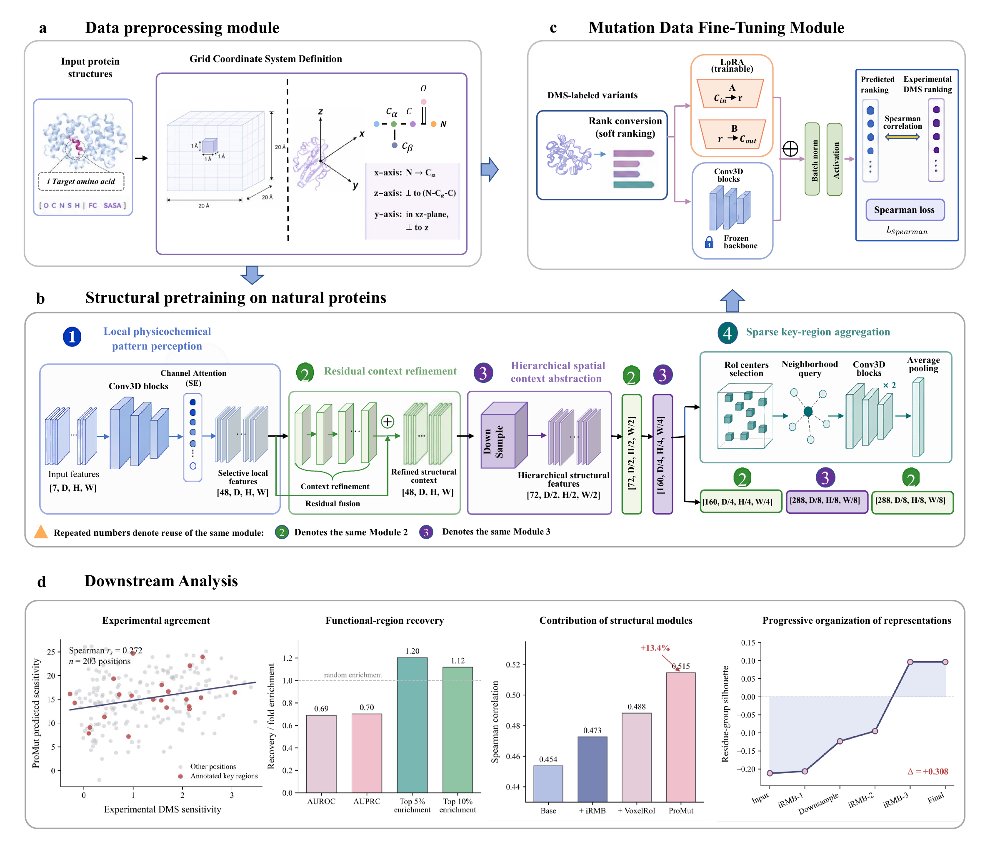

# ProMut: structure-pretrained local microenvironment modeling for protein mutation-effect prediction

通过结构预训练与 DMS 监督的 LoRA 微调预测蛋白质突变效应。ProMut 使用 iRMB 和 VoxelRoI 学习局部结构环境，再利用实验突变评分学习突变效应排序。

## 框架



```text
蛋白质结构 → 七通道体素 → 结构预训练
                              ↓
实验 DMS 数据 + 预训练骨干 → LoRA 微调
                              ↓
                         突变效应排序
```

[查看高清框架 PDF](docs/framework.pdf) · [实现说明](docs/整理说明.md)

框架图展示局部微环境构建、结构预训练、LoRA 微调及下游分析。图中结果来自提供的 PDF，并非本仓库本次运行结果。

## 安装

代码已在 Python 3.8.20、PyTorch 2.4.1 环境中通过冒烟测试。根据硬件选择 PyTorch，以下以 CPU 版本为例：

```bash
git clone https://github.com/AGI-FBHC/ProMut.git
cd ProMut
python -m pip install torch==2.4.1 torchvision==0.19.1 --index-url https://download.pytorch.org/whl/cpu
python -m pip install -r requirements.txt
```

从 PDB 开始预处理时，还需运行 `python -m pip install -r requirements-preprocess.txt`，安装 PDB2PQR 和 FreeSASA。若 FreeSASA 出现路径编码错误，请使用英文工作路径。完整数据训练建议使用 GPU。

## 数据

**数据集和模型权重未上传至本仓库。如需获取，请发送邮件至 [luochenxi@stu.jiangnan.cn](mailto:luochenxi@stu.jiangnan.cn)，注明所需文件。**

| 可申请的资源 | 用途 |
|---|---|
| `data_csv/`、`promut2_dataset/` | 已处理结构 CSV 与原始 PDB |
| `train_data/`，包括 NPZ 和原始 RAR 压缩包 | 已处理的预训练数据及标签 |
| `data_test_0.npz`、`label_test_0.npz`、`testset_TS50/`、`testset_T500/` | 结构评估数据 |
| `train_0613.npz`、`val_0613.npz` | 已处理的 DMS 训练与验证数据 |
| 预训练模型、`best_7093model.pth.rar` 及其解压内容 | 结构模型权重资源 |

执行下文命令前，请获取**完整可加载的权重文件**并放入 `ProMut1/best_7093model.pth.tar`；解压后的文件夹不能直接作为权重加载。DMS NPZ 放在项目根目录。数据格式见[数据说明](docs/DATA.md)。

## 1. 实验流程

所有命令从项目根目录执行。**已有提供的预训练权重和 DMS NPZ 时，可直接进入 1.3 节。**

### 1.1 局部微环境构建

**目的：**将残基周围的原子坐标、电荷与 SASA 转换为标准化局部体素，使模型学习三维结构和理化环境。

| 结构输入 | 用途 |
|---|---|
| `data_csv/*.csv` | 约 30,016 个天然蛋白结构 CSV，主要用于预训练 |
| `promut2_csv/csv/*.csv` | 从 `promut2_dataset/*.pdb` 转换，用于对应 DMS 蛋白的局部结构表示 |

将训练 PDB 转换为结构特征。新建 `pretrain_pdb/` 并放入预训练蛋白结构，与评估蛋白分开：

```bash
python -c "import sys; sys.path.insert(0,'ProMut1'); from data_utils import process_pdb2csv; process_pdb2csv('pretrain_pdb','pretrain_structure')"
```

输出为 `pretrain_structure/csv/`。在 `ProMut1/path_config.py` 中设置：

```python
DATA_CSV_DIR = os.path.join(PROJECT_ROOT, "pretrain_structure", "csv")
PRETRAIN_TRAIN_DATA_DIR = PRETRAIN_SHARD_DIR
```

随后生成体素并合并训练分片：

```bash
python ProMut1/generate_full_sidechain_box_20A.py
python ProMut1/build_pretrain_shards.py
```

输出：`pretrain_npz/` → `pretrain_shards/data_0.npz`～`data_19.npz` 及对应 `label_0.npz`～`label_19.npz`。每个残基表示为 `7×20×20×20` 体素，训练前需确认 20 对文件齐全。

已有 `data_csv/` 时，可跳过 PDB 转换并保留默认 `DATA_CSV_DIR`。已有 `train_data/` 时，可跳过预处理，改设 `PRETRAIN_TRAIN_DATA_DIR = os.path.join(PROJECT_ROOT, "train_data")`。

### 1.2 天然蛋白质结构预训练

**目的：**从随机初始化开始，学习根据局部结构预测中心残基的野生型氨基酸类别。采用 20 分类交叉熵；输出 `[N, 20]` 表示结构兼容性分数，不是直接的 DMS 功能评分。

```bash
python ProMut1/train.py
```

输入：配置指定的预训练分片；可选评估文件为 `data_test_0.npz` 和 `label_test_0.npz`。默认 8 个 epoch、batch size 150，在 `train.py` 中配置。

输出：`model_save/EMOCPD_VoxelRoI/train_epoch_*.pth.tar`；周期评估准确率改善时保存 `best*model.pth.tar`。从头训练时，在1.3 节使用实际生成的权重。

### 1.3 突变数据微调

**目的：**冻结预训练骨干参数，通过 LoRA 和可微排序损失，使预测排序接近真实 DMS 功能排序。

输入为 `train_0613.npz` 和 `val_0613.npz`。原始突变标签来自 `gym_single.csv`、`dms_single_fix.csv`，包含蛋白标识、如 `A11D` 的突变及实验评分；它们不能直接替代已处理 NPZ。

```bash
python ProMut1/rl_mutation_model.py --train_data train_0613.npz --val_data val_0613.npz --pretrained_model ProMut1/best_7093model.pth.tar --epochs 500 --batch_size 200 --output_dir model_save/ProMut_2
```

从头训练时，将 `--pretrained_model` 替换为1.2 节生成的权重。入口默认冻结骨干参数、添加 LoRA 并启用数据增强。

输出：`model_save/ProMut_2/best_model.pth`、定期保存的 `model_epoch_*.pth`、`final_model.pth`，以及 `analysis_outputs/` 中的逐蛋白分析记录。重复运行前请保留旧结果。

## 2. 实验设计

### 2.1 TS50 / TS500 序列恢复

**目的：**评估结构模型能否从局部环境恢复中心残基类型。指标为 Top-1 accuracy，即预测与真实氨基酸一致的残基比例。

先将测试 PDB 转为 CSV；以下以 TS50 为例，TS500 对应本项目的 `testset_T500/`：

```bash
python -c "import sys; sys.path.insert(0,'ProMut1'); from data_utils import process_pdb2csv; process_pdb2csv('testset_TS50','testset_TS50_csv')"
```

对生成的单个 CSV 运行预测，将 `protein.csv` 和链号替换为实际值。该入口直接从 CSV 构建体素，不要求先生成测试 NPZ。

```bash
python ProMut1/predict_emocpd.py --protein-csv testset_TS50_csv/csv/protein.csv --model ProMut1/best_7093model.pth.tar --chain A --topk 20 --out predictions/TS50_protein.csv
```

输出包含 `Actual AA`、`Pred AA 1` 和候选置信度。对所有测试蛋白重复预测后，按有效残基统计整体恢复率：

```python
from pathlib import Path
import pandas as pd

results = pd.concat([pd.read_csv(p) for p in Path("predictions").glob("TS50_*.csv")])
accuracy = (results["Actual AA"] == results["Pred AA 1"]).mean()
print(f"Residue-weighted recovery: {accuracy:.4f}")
```

这是按残基加权的汇总；如需按蛋白平均，应另行计算并注明口径。`--effect-out predictions/effects.csv` 可选导出 `log P(突变) − log P(野生型)`，属于预训练结构分数。

### 2.2 DMS 突变效应排序

**目的：**评价预测分数与真实 DMS 排序的一致性，关注突变功能而非野生型分类。

运行 1.3 节微调命令后，`rl_mutation_model.py` 每轮读取 `val_0613.npz`，按蛋白质分组验证。核心计算如下（训练入口内的逻辑片段）：

```python
outputs = model(data)
loss = criterion2(outputs, mutation_labels, mutation_types, ranked_types)
correlation = -loss.item()
```

当前实现使用软排名构造相关性损失，并输出逐蛋白记录到 `analysis_outputs/`；该训练代理量不应直接当作另行计算的标准硬排名 Spearman 系数。正式报告时需注明位点、蛋白质及数据集的聚合口径。

验证损失最低时保存 `best_model.pth`，结束时保存 `final_model.pth`。当前没有独立微调推理入口，不能用 `predict_emocpd.py` 直接加载这些微调权重。

| 阶段 | 监督信号 | 主要目标 | 输出含义 |
|---|---|---|---|
| 预训练 | 野生型氨基酸类别 | 交叉熵 / 序列恢复率 | 局部结构兼容性 |
| 微调 | 实验 DMS 评分及排序 | 可微排序相关性损失 | 突变功能效应排序 |

## 说明

- 对外模型名为 `ProMutBackbone` 和 `ProMutPredictor`，兼容旧名称 `EMOCPD_VoxelRoI` 和 `HybridMutationPredictor`。历史脚本名与输出路径保留。
- 微调 NPZ 需包含 `data`、`positions`、`protein_names`、`mutation_labels`、`mutation_types`、`ranked_types`。当前未包含从原始 DMS 标签完整生成这些 NPZ 的脚本。
- `predict_emocpd.py` 加载的是**预训练骨干**，不能直接加载微调权重；其输出不是 DMS 微调结果。当前未包含独立微调推理入口。
- 冒烟测试不代表已完整复现论文实验结果。
